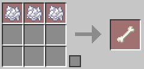
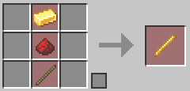

# カスタムクラフトデータパック

**Java版専用です**

ピースフルで遊んでいると、敵mobを倒さないと手に入らないアイテムが出てきます。  
でもピースフルなので敵は出ません。

なので、レシピで取得できるようにしました。  
お子さんにモンスターと戦わせなくない、と思っている親の皆さんには役に立つのではないでしょうか。

レアアイテムはそれなりにコストが高くなっています。

## インストール方法

右上の「Code」ボタンを押して、 `Download ZIP` を選択するとzipファイルがダウンロードできます。  
それを解凍して `custom_craft-main` フォルダを

シングルプレーなら `.minecraft` → `saves` → `入れたいワールド` → `datapacks` の中に入れてください。

マルチサーバーなら `.minecraft` → `world` → `datapackes` の中に入れて `reload` コマンドでリロードしてください。

## レシピ

### 火薬

砂・レッドストーンダスト

### 骨

骨粉

### マグマクリーム

マグマブロック

### ファントムの被膜

革・ハニカム

### 糸

羊毛（色は問わない）

### スライムボール

コーラスフルーツ・緑の染料

### クモの目

ニワトリの卵・レッドストーンダスト

### ガストの涙

金インゴット・ダイヤモンド

### ブレイズロッド

金インゴット・レッドストーンダスト・棒

### オウムガイの殻

焼いたコーラスフルーツ・ネザークォーツ

### ネザースター

ネザライトインゴット・ダイヤモンド

### エンダーパール

頑張って聖職者を育てて、パールを売ってもらえるようにしましょう。
